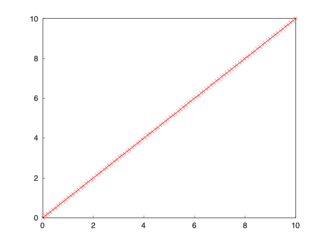

## CSCI 114 Lab 7 Plotting
In this lab we will get practice plotting data using C++.

#### Prerequisites 

In order to complete this lab you will need to have the software package Matplot++ installed. On macOS with homebrew this can be done with:

```bash
brew install matplotplusplus
```

Once installed put `#include <matplot/matplot.h>` in the includes section of your .cpp files. Then you can compile with:
clang++ -std=c++17 -I/opt/homebrew/include/ -L /opt/homebrew/lib -l matplot task1.cpp -o task1 
```bash


```
Where `program.cpp` is your code and `program` is the output executable.

### Task 1
For task 1 we will just test that you can compile and run `matplot++` code:

```c++
#include <cmath>
#include <matplot/matplot.h>
using namespace matplot;

int main() {
	
	std::vector<double> x = linspace(0, 10);
	std::vector<double> y = x;
			
	plot(x, y, "-xr");
	show();
	save("task1.png");
	return 0;
}
```
Assuming this works you should get an interactive GNUplot window. After you close the window, hit enter in your terminal. You should then get the following image:


### Task 2

For task 2 we will be working with data from a sounding rocket lauched at 1200 hours on Sunday October 20th from Vandenberg Air Force Base. The data is tab-delimited and the first few rows look like this:

```
-----------------------------------------------------------------------------
   PRES   HGHT   TEMP   DWPT   RELH   MIXR   DRCT   SKNT   THTA   THTE   THTV
	hPa     m      C      C      %    g/kg    deg   knot     K      K      K 
-----------------------------------------------------------------------------
 1005.0    121   11.0   -3.0     37   3.06    130      7  283.8  292.7  284.3
 1003.0    129   15.6   -6.4     21   2.37    145      4  288.5  295.7  288.9
 1001.0    138   16.9   -6.4     20   2.38    160      1  290.0  297.2  290.4
 1000.0    142   17.6   -6.4     19   2.38    155      2  290.8  298.0  291.2
```

The first step for task 2 is to parse the data from the file. You can read and discard the first 4 lines. Then parse each line saving the "HGHT" (height) data as the x values. Save the "PRES" (pressure) values in another vector and the "TEMP" (temperature) values in a 3rd vector. The vectors should all be type `double`.

Now plot the pressure vs. the height. Research the line styles and how to set the xlabel and ylabel so that you get the following graph. Save the image as `task2a.png`


Now we want to add a secondary dataset on the other y-axis. Matplot++ allows you to plot on the secondary y-axis. First we need to find the min and max values for temperature using iterators and `std::max` and `std::min`:

```
	double t_min = *std::min_element(t.begin(), t.end());
	double t_max = *std::max_element(t.begin(), t.end());
```
Adding the following three lines to your code should add the temperature:

```
hold(on);
plot(h,t, "-rx")->use_y2(true);
y2lim({t_min, t_max});
```
Finally add the y2label and you should get:


Save this image as `task2b.png`
